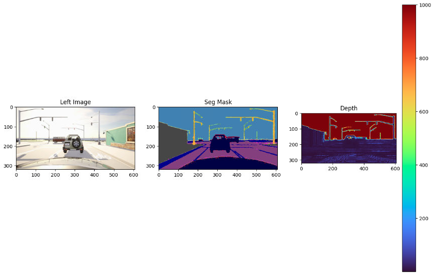
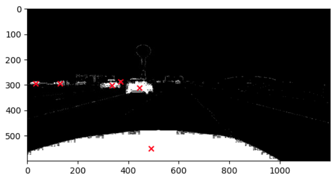

```bash
    git clone https://github.com/PardisTaghavi/Mcity2.0_demo.git
    cd Mcity2.0_demo.git
```

Create a conda environment and activate it:
```bash
    conda env create --file ros2_env.yaml
    conda activate ros2_env
```

### Testing

Download Pretrained Models:
    - [here](https://drive.google.com/file/d/1ksuJt2aEqr91tGQp_3oarJ4XREwFCC0A/view?usp=sharing) to access the pretrained models.
    - Create a new folder named `model_zoo` and move the pretrained model into the model_zoo folder.


```bash
python mcityOutRos2.py 
```


<p align="center">
  
  
</p>

train_dataset:  7394
val_dataset:  1849


   
